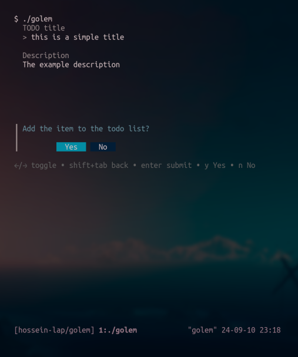
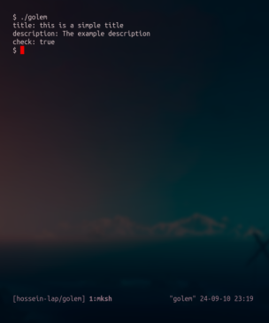

= Golem

Simple app to have a todo list in a nice and clean TUI, using
https://charm.sh[huh] project. Damn I love this project.

Just chew your gum and bubble some tea ;))

== Why?

I enjoy playing with golang and TUIs, so, why not? ;)

== Prototype

* `.yml` i/o
** Separate menu for each operation
** `input` menu for insertion
** Basically create my-own CRUD system
*** You think this will create something like `mongodb` later on? LMAO
** Display menu
* Toggle item
** Extra attribute for `status`
* Try not to make it resource heavy
** Yeah CLIs can also become resource heavy, don't believe me? Look at Python (just kidding, I meant JavaScript)
*** Of course I'm kidding, you can try it some too ;)

=== Screenshot

.Really? Okay

== Compile

NOTE: Please have `golang` installed :)

.Installing the dependencies
[source,bash]
----
go mod tidy
----

.Compile
[source,bash]
----
go build .
----

.Run
[source,bash]
----
./golem
----

